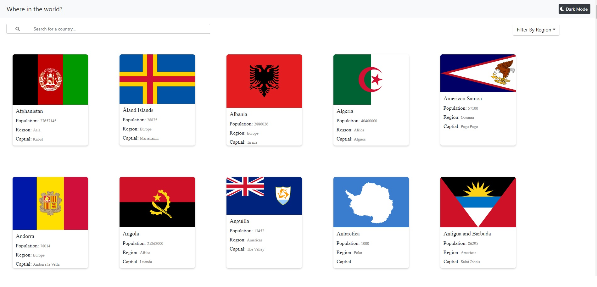
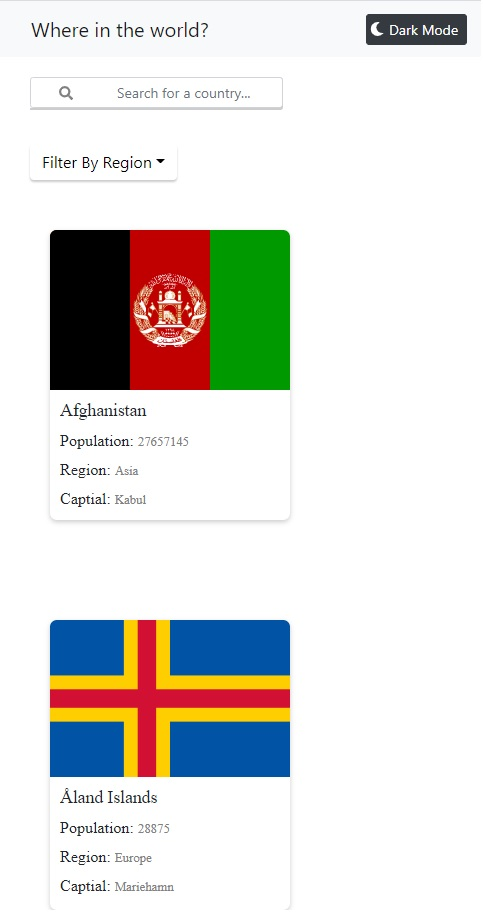

# Frontend Mentor - REST Countries API with color theme switcher solution

This is a solution to the [REST Countries API with color theme switcher challenge on Frontend Mentor](https://www.frontendmentor.io/challenges/rest-countries-api-with-color-theme-switcher-5cacc469fec04111f7b848ca). Frontend Mentor challenges help you improve your coding skills by building realistic projects.

## Table of contents

- [Overview](#overview)
  - [The challenge](#the-challenge)
  - [Screenshot](#screenshot)
  - [Links](#links)
- [My process](#my-process)
  - [Built with](#built-with)
  - [What I learned](#what-i-learned)
  - [Continued development](#continued-development)
  - [Useful resources](#useful-resources)


## Overview

### The challenge

Users should be able to:

- See all countries from the API on the homepage
- Search for a country using an `input` field
- Filter countries by region
- Click on a country to see more detailed information on a separate page
- Click through to the border countries on the detail page
- Toggle the color scheme between light and dark mode *(optional)*

### Screenshot





### Links


- Live Site URL: [Rest-country-api-React](https://rest-country-api-react.herokuapp.com/)

## My process

### Built with

- Semantic HTML5 markup
- CSS custom properties
- Flexbox
- CSS Grid
- Mobile-first workflow
- [Fontawesome](https://fontawesome.com/)
- [Bootstrap](https://getbootstrap.com/)
- [React](https://reactjs.org/) - JS library
- [React-bootstrap](https://react-bootstrap.github.io/)

### What I learned

Learned how to utilize the BrowserRouter from react-router-dom to handle routing within the site.

```js
<Router>
    <Switch>
      <Route path="/" exact component={Home}/>
      <Route path="/country/:country" exact component={DetailsPage}/>        
    </Switch>
</Router>
```

And how to use the params from react-router-dom.
```js
function DetailsPage({match}){
  let{
    params: {country}
  } = match;
```


### Continued development

Implementing dark mode to the project.
Unsure about the approach as most articles about were quite vague about it.

Unsure about using modules.css and or sass for projects of this size.

### Useful resources

- [React css styling break on changing route](https://stackoverflow.com/questions/60863890/why-does-css-styling-disappear-in-react-when-directly-changing-route-in-browser) - Was quite informative about why it happened and its solution.
